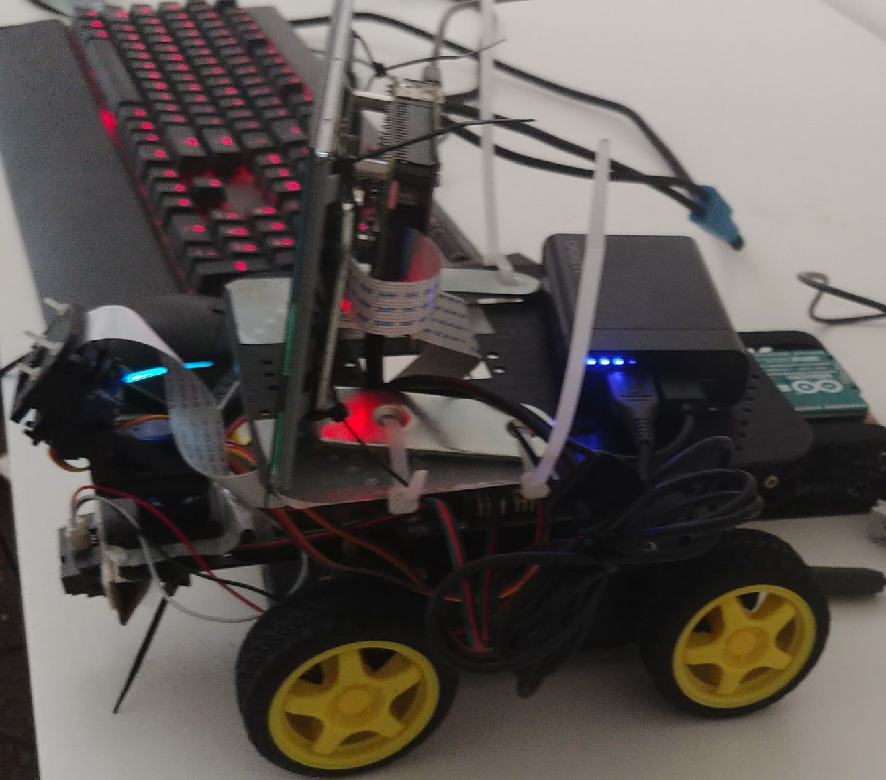
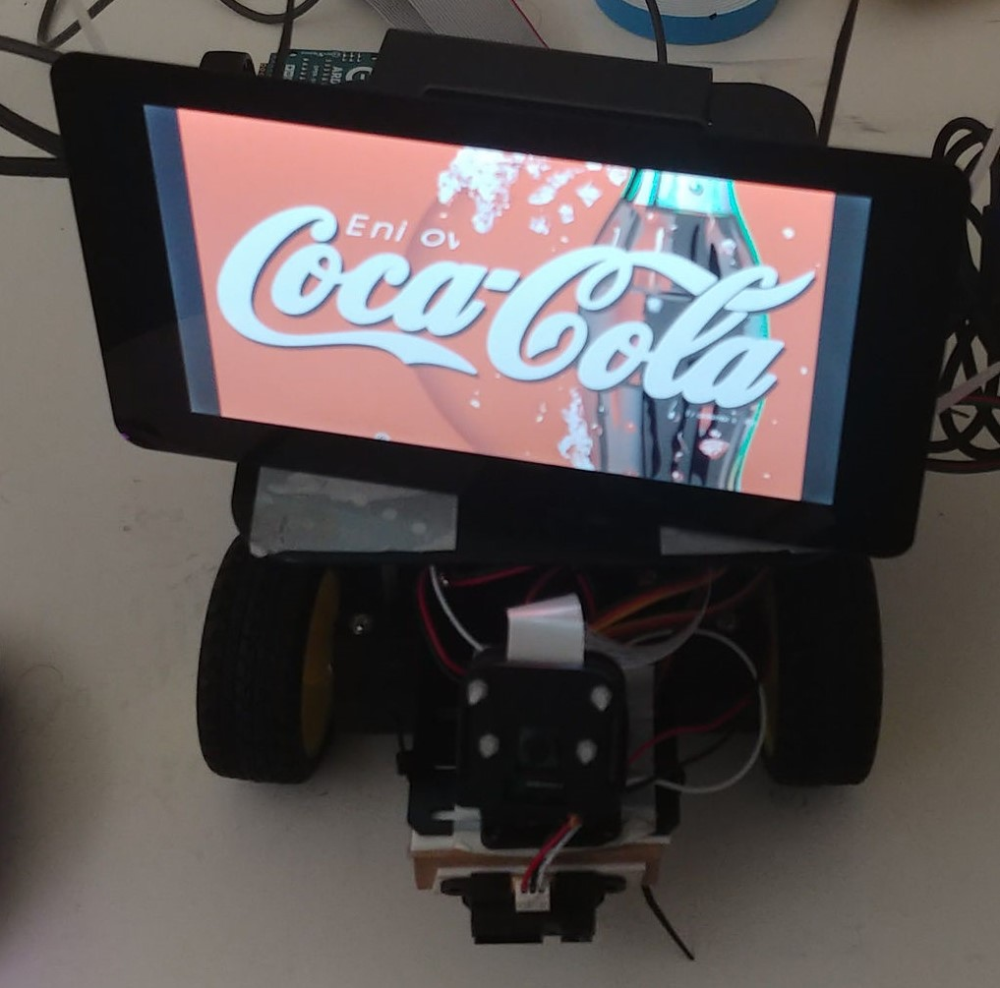

# Cocteau

## About

Cocteau is the artefact I built as a part of the the ANU's IoT@BIT study tour, during the (Australian) Summer of 2018 to 2019. It is a prototype for an art project exploring the themes of privacy and surveillance in the context of the Internet of Things. It places emphasis on the concept of a "Dossier Society" - A Society where everything an individual does is tracked and collected into "dossiers". 

I have written about why privacy matters in the [course blog](https://cs.anu.edu.au/courses/china-study-tour/news/#chocolatier), which also documents my design process. Particularly in weeks [#5](https://cs.anu.edu.au/courses/china-study-tour/news/2018/12/24/chocolatier-privacy/), [#6](https://cs.anu.edu.au/courses/china-study-tour/news/2019/01/04/chocolatier-project-diary/) and [#11](https://cs.anu.edu.au/courses/china-study-tour/news/2019/02/08/chocolatier-project-diary6/). 

Conceptually, anything that reads data from the environment and can transmit it to other parts of the internet can be added to Cocteau. However, my project focuses on Audio and Video capture. 

It consists of Raspberry Pis with Cameras and Microphones mounted on Arduino controlled rovers. The rovers explore the surroundings until the Raspberry Pi asks it to stop. The Raspberry Pi listens to and looks at the surroundings, transcribing everything it hears and taking photos at regular intervals. 

## Photos 

## Hardware 

The project relies on a Raspberry Pi, and Arduino, a Rover and accessories. See the [Bill of Materials](bill_of_materials.md) and [Build Instructions](build_instructions.md) for detailed information.

## Software Setup

All the code is built on the Raspberry Pi, so there is no specialised toolchain required. You only need another computer to flash Raspbian onto an SD Card. After which, you can develop entirely on the Raspberry Pi. 

This is NOT recommended. 

My personal workflow involved SSHing in from another machine, and using nvim to edit the files. So any computer with an SSH Client will do.  

### Raspberry Pi 

The Raspberry Pis run [Raspbian](https://www.raspberrypi.org/downloads/raspbian/) Stretch. 

The PiCam and TFT LCD work out of the box, and require no external drivers. You need to install the drivers for the ReSpeaker hat by following the instructions in the [official documentation](https://github.com/respeaker/seeed-voicecard#seeed-voicecard).

You need to enable the Camera and SSH, if you are using that. 

This can be done by running

`sudo raspi-config`

The toolchain for the Python code is included with Raspbian. All you need is pip and Python 3.5+, which is already included. 

To execute the a particular python script 

``
 cd ../cocteau/pi 
 python3 script.py
``

Note that `panandtilt.py` polls for the presence of an Arduino before it starts, so you also need the Arduino running before you can use it. 

#### Python Libraries

You will need to install the following libraries:

* PIL `pip install Pillow`

* Google Cloud Speech to Text `pip install google-cloud-speech`

* Google Cloud Language `pip install google-cloud-language`

* azure-cognitiveservices-search-imagesearch `pip install azure-cognitiveservices-search-imagesearch`

To use the Google API, you need to have an account on the Google Cloud Platform and have set up environment variables correctly.

Follow the [guide by Google](https://cloud.google.com/speech-to-text/docs/quickstart-client-libraries). 

To use the Bing Image Search API you will need a Microsoft Azure account, and get your subscription key. 

Microsoft has their documentation [here](https://docs.microsoft.com/en-us/azure/cognitive-services/bing-image-search/image-sdk-python-quickstart).

The subscription key has to be placed in `cocteau/pi/bing_key.txt`

For Face Tracking 

* You will first need to install OpenCV. This is provided in the raspbian repo.

`sudo apt-get install opencv`

Then you need to install the Python Bindings

`pip install opencv-python`

### Arduino

I used [Arduino IDE](https://www.arduino.cc/en/Main/Software) to write the Arduino control code. 

The [SharpIR](https://github.com/guillaume-rico/SharpIR) is the only external library my code depends on. To use it, clone the clone the linked repo into `~/sketchbook/libraries/`. 
To compile/upload/run the Ardunino code, open `/arduino/arduino.ino` in the Arduino IDE, and upload. 

## Contributing 

Feel free to fork and/or send pull requests :).

The directory structure is pretty simple. 

The `pi/` folder contains everything that runs on the Raspberry Pi.

The `arduino/` folder contains everything that runs on the Arduino. 

The code is mostly se

The issues contain some enhancements I would like to add in the project, but will likely not get around to myself any time soon, because I'll be busy with my semester 1 subjects. 

I probably won't be super responsive to any issue you open either. The best (most effective in getting a response) way to get contact would be to email me. 

## TODOs

There are quite a few [TODOs](https://github.com/chocolatier/cocteau/issues) before this project is complete. 

*    We need to add more and better sensors to the robot, so that it can move around without bumping into obstacles or falling off.

*   Scene analysis. I am not at all comfortable with this, but it is possible to use Google’s Cloud Vision API or Microsoft’s Cognitive services to analyse the camera input.

*    Object tracking - Follow the object MS/Google detect around. With some backup local code in case the connection drops.

*    Communication - The devices should be able to share data independently

* Multiplexing the different parts into a single script

* Decoupling from Google/Bing. There is no reason the code should be hardcoded to use those two services. 

* Voice Activity/Direction direction

## Contact 

The best (least annoying) way to reach me is to open an issue on GitHub. You may also email me at \[github username\] \[at\] dedekinddomai \[dot\] nz

## Acknowledgement/References

The code in this repository is extremely derivative.  

I have amalgamated the [Pimoroni Face Tracker](https://github.com/pimoroni/PanTiltFacetracker/blob/master/facetracker_lbp.py) example with [Arduino Robust Serial](https://github.com/araffin/arduino-robust-serial/) for the face tracker.

The `audio.py` is an extension of `transcribe-streaming-indefinite` from the [Google Cloud Platform Documentation](https://github.com/GoogleCloudPlatform/python-docs-samples/tree/master/speech/cloud-client), modified to analyse the results of that transcription. 