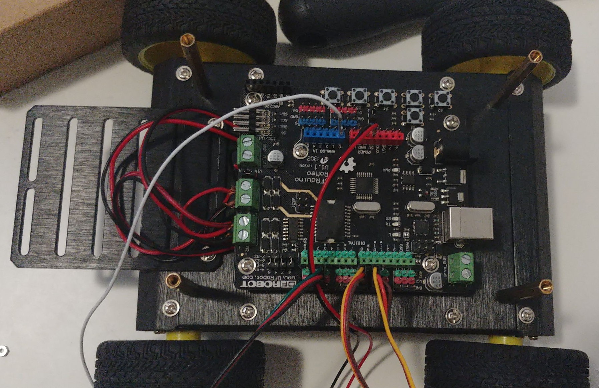
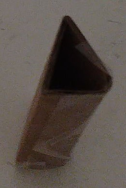
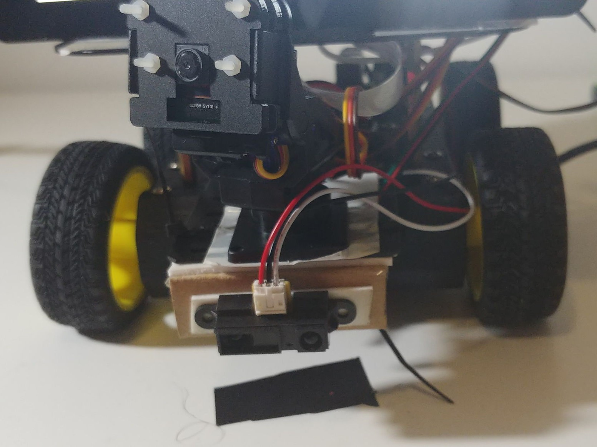
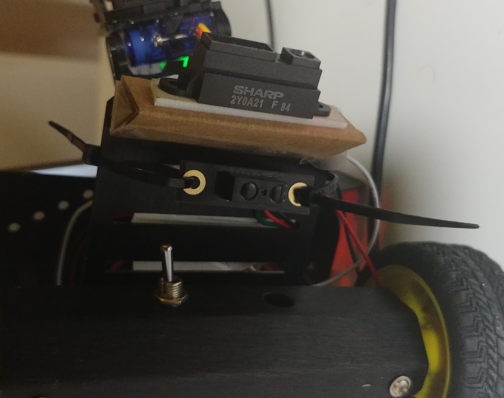
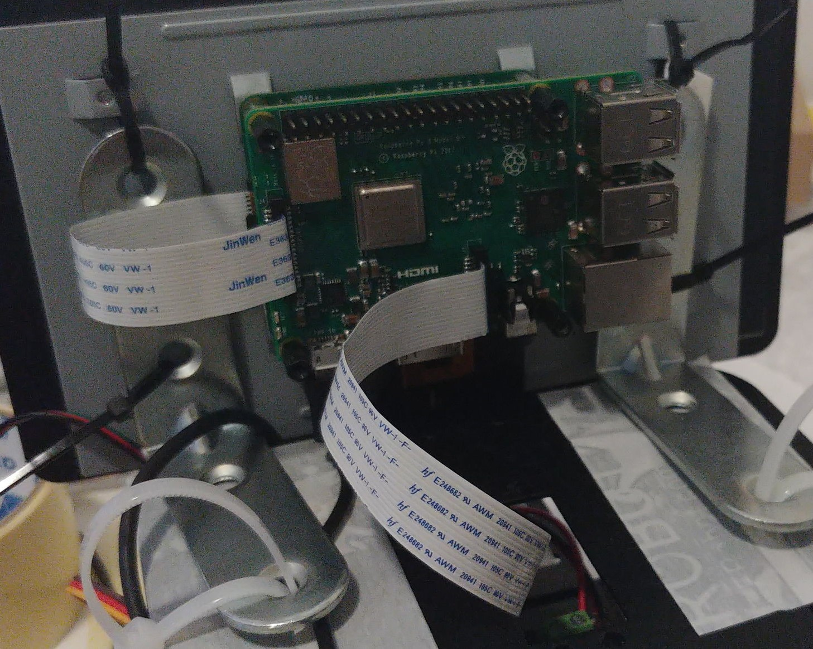
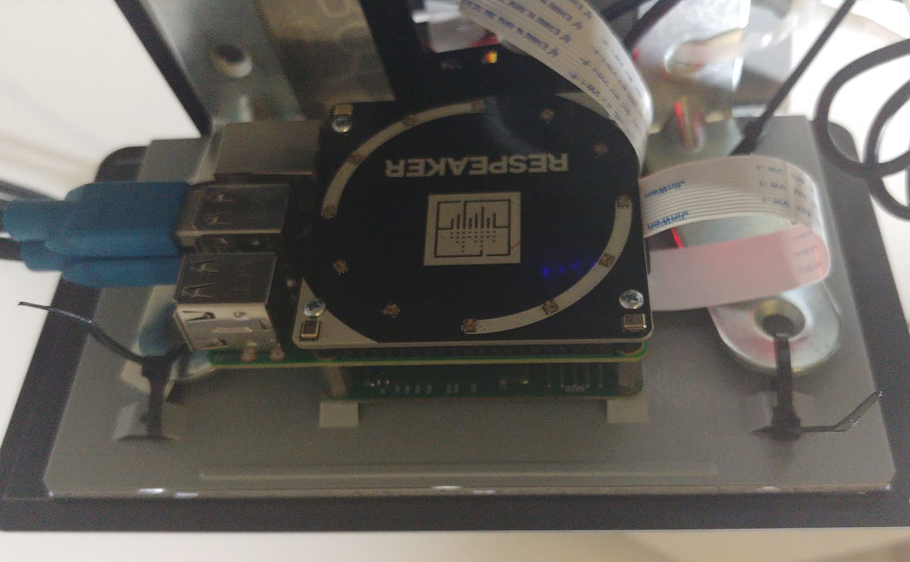

# Build Instructions 

Note: The images were taken out of order. I am reusing older photos I took for the blog, and some photos, are staged by disassembling the rover slightly. Each should act as a guide for the specific step only, and not the overall progress. 

## Rover Wiring

First, build the DFRobot Pirate according to the instructions [here](https://www.dfrobot.com/wiki/index.php/Pirate_4WD_Mobile_Platform_SKU:ROB0003). Disregard the instruction manual that came with the kit. The above wiki is a lot more detailed, and also has guide on wiring.  

Before you attach the 2nd plate, wire the additional sensors and servos to the Romeo Microcontroller. 

### Mini Pan-and-Tilt Hat 

Attach the Pan Wire to Digital Input 8

Attach the Tilt Wire to Digital Input 9

### Sharp GP2Y0A21YK0F 

Plug the 3 Pin Cable in first. Then wire the live (red wire) to 5V, the ground (black wire) to GND and the analog (white wire) to A0. 

### DFRobot 10cm infrared sensor

Attach it to one of the three pin Digital Input Sets - I have used 2. 

## Mounts 

### Sharp GP2Y0A21YK0F 

Construct a triangle out of cardboard, and tape the sensor onto one side. !

Tape the other side to the bottom of the sensor plate. (See image below)

### Pan and Tilt Hat 

Tape it onto the top of the sensor plate. 

Make sure that it is oriented correctly, so that when the panning servo is centered, it points towards the front of the rover. 

## DFRobot 10cm Infrared Sensor

Ziptie it to the bottom of the sensor plate. 

# Raspberry Pi

* Replace the camera's CSI cable with the longer CSI cable. 

* Connect the screens DSI cable to the Pi's display port. 

* Connect the CSI cable to the Pi's camera port. 

Note: that the port covering is a bit tight, so you do have to apply some force to get it open. 
Conversely, you should hear/feel a click when you have inserted the cable and close the "cap" again. 

* Place the Pi on the stand offs on the back of the TFT display. 

* Screw in the the 2.5mm standoffs to secure the Pi to the Screen. 

Insert the ReSpeaker Hat and screw it in. The screws that come with the Pi TFT display work perfectly. 

* Ziptie the assembled screen to the L-Brackets.

* Ziptie the L-Bracket to the top of the rover plate. 

(See Image above)

* Place the Pi Cam in the mounting kit that came with the Mini Pan and Tilt Kit. 

* Place the PiCam on the Pan and Tilt Servo.

(See image for sensor plate)

Last but not least, Place the Power Bank on the top plate. 

### Wiring

* Connect the power bank to the Raspberry Pi and the Pi Screen 

* Connect the Pi to the Arduino via a USB A cable. 